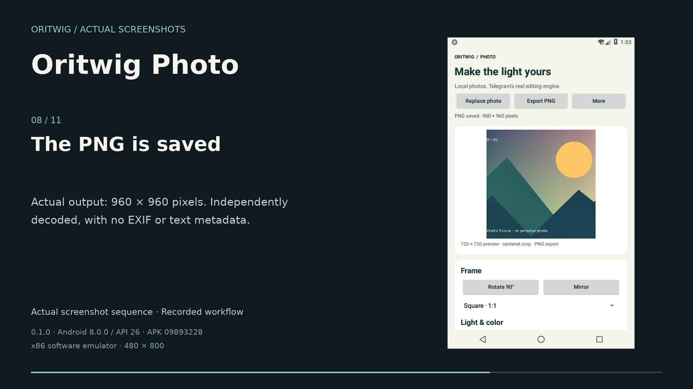
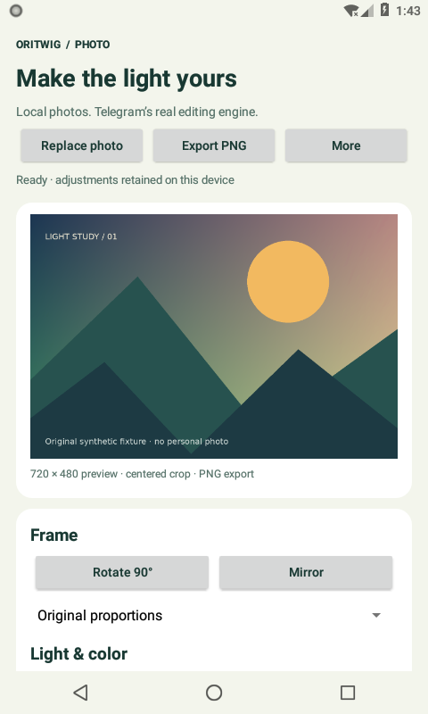
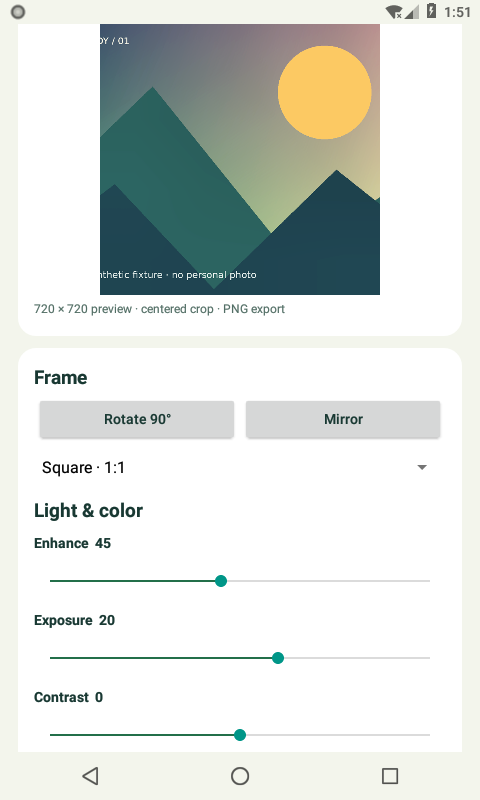
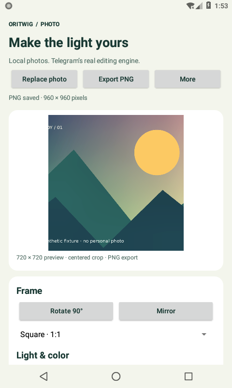

# Oritwig Photo

An offline Android reference app for the retained Telegram photo-filter and crop
pipeline, with a bounded local photo-finishing workflow.

Developer preview 0.1.0. The complete import/edit/export/reopen workflow and
37 native assertions pass on Android 8 / API 26. Physical-device and Android 35
runtime coverage remain pending. [Validation scope](docs/VALIDATION.md).

## See it working

[](docs/media/demo.mp4)

[Watch or download the 52-second walkthrough](docs/media/demo.mp4) (210 KB, silent) · [Capture details and hashes](docs/media/manifest.json)

This is an **edited sequence of genuine full-screen Android screenshots**, not a live screen recording. It uses the tested **0.1.0** APK on an **Android 8 / API 26 x86 software emulator, 480 × 800**. The source image is an original generated illustration, with no personal photo.

Follow the imported image through square crop, rotation, mirroring, Enhance **45**, Exposure **20**, Android PNG export and reopening. Rotation and mirroring are returned to upright/unmirrored before the final edit. After force-stop and reopening, the second **960 × 960 PNG** is byte-identical to the first.

<a href="docs/media/screenshots/gallery-01-import.png"></a>
<a href="docs/media/screenshots/gallery-06-exposure.png"></a>
<a href="docs/media/screenshots/gallery-08-saved.png"></a>

Full-screen workflow captures: [Imported image](docs/media/screenshots/gallery-01-import.png) · [Square crop](docs/media/screenshots/gallery-02-crop.png) · [Rotate](docs/media/screenshots/gallery-03-rotate.png) · [Mirror](docs/media/screenshots/gallery-04-mirror.png) · [Enhance](docs/media/screenshots/gallery-05-enhance.png) · [Exposure](docs/media/screenshots/gallery-06-exposure.png) · [Android save picker](docs/media/screenshots/gallery-07-export.png) · [Saved PNG](docs/media/screenshots/gallery-08-saved.png) · [Reopened](docs/media/screenshots/gallery-09-reopen.png) · [Repeated export](docs/media/screenshots/gallery-10-repeat.png) · [Settings](docs/media/screenshots/gallery-11-settings.png)

Also checked: [Replacement picker](docs/media/screenshots/gallery-12-picker.png) → [Cancel preserves the current edit](docs/media/screenshots/gallery-13-cancel.png). The [tone-curve dialog after cancellation](docs/media/screenshots/gallery-14-curves.png) shows its original values; no applied curve edit is claimed in this example.

Compare the [original synthetic input](docs/media/examples/input.png) with the [actual exported PNG](docs/media/examples/exported.png). Exported pixels were independently decoded, with no EXIF or text metadata. [Full verification scope and remaining device limits](docs/VALIDATION.md).

## A complete, bounded photo workflow

Open a local PNG/JPEG/WebP → choose a centered crop, rotate or mirror → adjust
light/color or RGB/luminance curves → export an ordinary PNG. The most recent
photo and its adjustments resume when reopening the app. Settings choose system,
light or dark appearance and a 1024/2048-pixel maximum exported edge.

No account, Telegram installation, API key, server, network permission, analytics
or model service. Paint, layers, editable project collections, HDR, video and
freeform crop are not part of this version.

The retained upstream implementation performs every image adjustment, crop
transformation and pixel readback. See [provenance](docs/PROVENANCE.md) for the retained implementation and its thin adapters.

## Telegram and Oritwig Photo: what differs?

Primary upstream: [Telegram Android at f2908b14](https://github.com/DrKLO/Telegram/tree/f2908b14133bbffbf7ab04f641ecb5bfaf533242).

| | Telegram's original editor | Oritwig Photo |
| --- | --- | --- |
| Product | Media editing inside the full messaging client | A standalone local photo-finishing app |
| Core | GLES filter passes, curves, native enhancement and crop geometry | Those real implementations retained; no newly invented filters |
| Dependencies | Editor integrated with client/account utilities and media workflows | A separately buildable media library; no account, API, server or messaging code |
| File flow | Integrated Telegram media-edit/send flow | Android document picker → private working copy → user-selected PNG destination |
| Included UI | Rich photo/video, paint and media tools | Focused light/color controls, curves, centered crop presets, rotate/mirror, reset and settings |
| Deliberate limits | Broader editing and messaging features | No messaging, HDR, video, paint, stickers, layers or freeform crop; optional skin smoothing and its private tone mapper are omitted because their immediate port provenance was not established |

The reusable candidate is the pinned Telegram GLES filter chain, native `calcCDT`
enhancement and crop geometry when a project specifically needs that pipeline's
behavior. Our new work is the local UI, platform file adapters, error/lifecycle
handling and one-session preference storage; upstream account-backed drafts are
not reused or replaced with a new database. [Exact source changes](docs/PROVENANCE.md)
identify retained code, removals and each necessary addition. Full Telegram-editor
parity and cross-device pixel equivalence have not been established.

For generic adjustments, [GPUImage for Android](https://github.com/wasabeef/android-gpuimage#readme)
already supplies reusable OpenGL filters, and [uCrop](https://github.com/Yalantis/uCrop#readme)
already supplies an Android cropping library and sample. Oritwig Photo is worth
evaluating for the specific retained Telegram pipeline or this reference workflow.
There is no demonstrated image-quality, performance or integration advantage over
those alternatives. The validation below covers this preview's stated workflow,
not a comparative benchmark.

## Install a preview

Preview APKs use debug signing keys. A local or CI build may use a different key,
so an in-place update is not guaranteed. Export wanted photos before uninstalling:
uninstalling removes the private working image and its retained adjustments.
No production signing key is distributed.

## Build

Use JDK 21, SDK 35/build-tools 35.0.0, NDK 27.2.12479018 and CMake 3.22.1.
Gradle 8.11.1 and AGP 8.9.3 are pinned, with strict dependency verification.

```sh
./gradlew :app:assembleDebug :app:lintDebug :app:testDebugUnitTest
adb install app/build/outputs/apk/debug/app-debug.apk
adb shell am start -n dev.oritwig.photo/.MainActivity
```

Native product assertions:

```sh
./gradlew :app:assembleDebugAndroidTest
adb install -r -t app/build/outputs/apk/androidTest/debug/app-debug-androidTest.apk
adb shell am instrument -w -r dev.oritwig.photo.test/dev.oritwig.photo.PhotoInstrumentation
```

Packaged ABIs: arm64-v8a, x86 and x86_64. This preview does not support
32-bit ARM devices.

Use a dedicated test device. Compilation and JVM assertions are not a native test
pass. This directory includes the engine and crop source; no sibling checkout is
needed. Exact engine source hashes are recorded in vendor/telegram-engine.

The metadata helper is updated from Telegram's AndroidX ExifInterface 1.3.6 to
1.4.2 for maintained JPEG/EXIF parsing on older Android versions. It is not an
image-processing replacement. [Dependency versions, sources and hashes](third_party/androidx-exifinterface/dependencies.json) are retained.

## Local files and limits

- Up to 25 MiB and 32 megapixels per import; at least eight pixels per side
  after preparation. Extremely narrow images can be rejected
- Platform-decoded still images only; animation is not retained
- Import prepares a private, metadata-free PNG at at most 2048 pixels; no upscaling
- Import leaves original files untouched. Export writes only to the destination
  you choose; PNGs omit source EXIF/GPS metadata
- Last-session values use Android preferences, with no custom database or archive
- No automatic Android cloud or device-transfer backup. Uninstalling removes the
  private session; keep exports you want to retain
- User-selected document providers can sync exports to their own cloud. Removing
  the local session cannot retract those files and is not secure erasure

The renderer preserves upstream effect-dependent alpha behavior. Reset bypasses
filters; an adjusted state uses the upstream baseline sharpening. No independent
claim of HDR/color-management equivalence is made.

## License

The combined app is GNU GPL version 3, selected under Telegram Android's
[GPLv2-or-later project grant](https://telegram.org/apps#source-code). Original
file notices and the upstream GPL v2 text are preserved. AndroidX ExifInterface
1.4.2 and its dependency sources/notices retain their Apache-2.0 terms.
The optional unverified smoothing port is omitted. Retained implementation,
licenses and exact source pin are documented in the provenance ledger.
No Telegram affiliation or endorsement is implied. All compiled engine/crop source, upstream notices, origin hashes and the crop
extraction script accompany this prototype. Excluded upstream code is not bundled.
